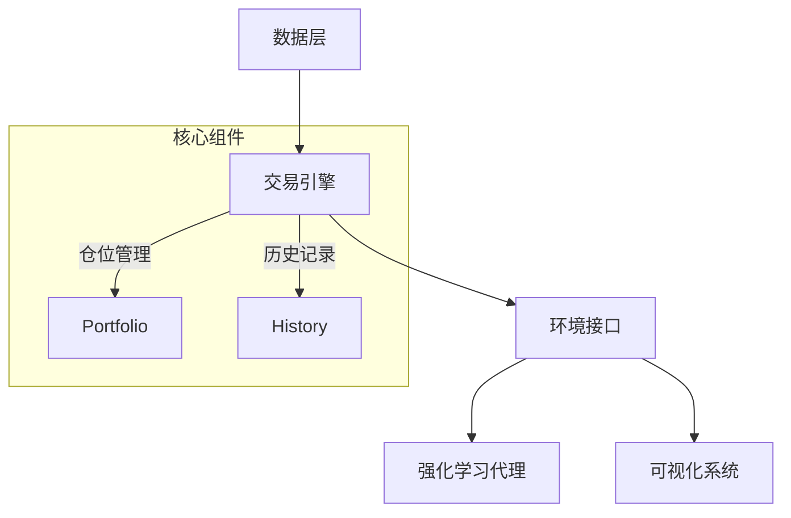

# Gym Trading Environment 项目概述

## 业务目标
提供一个高度可定制的强化学习交易环境，用于：
- 快速开发和测试交易算法
- 支持多资产类别和多市场回测
- 提供直观的可视化分析工具

## 核心功能
1. **交易环境模拟**
   - 支持多种仓位策略(0-100%仓位)
   - 自定义交易手续费设置
   - 多时间尺度数据支持

2. **强化学习集成**
   - 兼容Gymnasium接口标准
   - 可定制的奖励函数
   - 多层次终止条件(日亏损、最大回撤等)

3. **高性能可视化**
   - 实时渲染数十万根K线
   - 交互式回放功能
   - 自定义指标分析面板

4. **数据支持**
   - 多交易所数据下载
   - 多资产类别支持
   - 自定义特征工程

## 整体架构


## 关键数据实体
1. **市场数据**
   - OHLCV基础数据
   - 技术指标特征
   - 动态生成特征

2. **账户状态**
   - 当前仓位比例
   - 资产分布(现金/持仓)
   - 组合净值曲线

3. **交易记录**
   - 每日盈亏
   - 交易信号
   - 执行价格

## 业务流程
1. **初始化阶段**
   - 加载市场数据
   - 设置交易参数
   - 初始化投资组合

2. **训练循环**
   ```python
   while not terminated:
       action = agent.predict(obs)
       obs, reward, terminated, truncated, info = env.step(action)
       agent.learn(obs, reward)
   ```

3. **分析阶段**
   - 生成绩效报告
   - 可视化交易行为
   - 策略优化迭代
